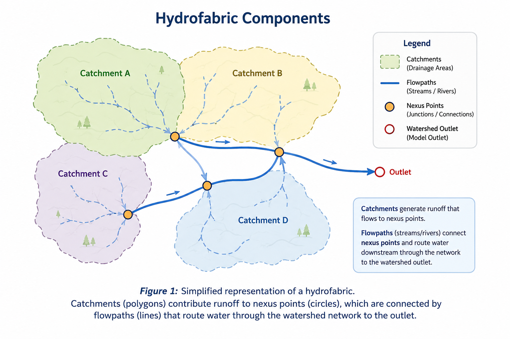
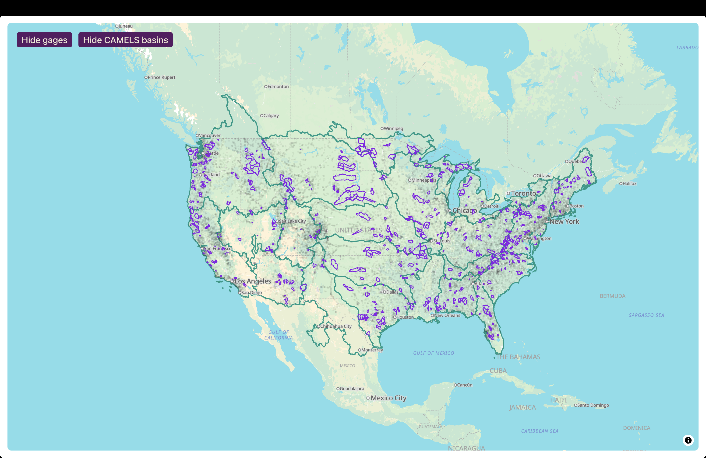

:::::::::::::::::::::::::::::::::::::: questions

- How does the Community Hydrofabric support NGIAB workflows?

::::::::::::::::::::::::::::::::::::::::::::::::

::::::::::::::::::::::::::::::::::::: objectives

- Explain how the Community Hydrofabric interacts with NGIAB
- Identify the improvements provided by the Community Hydrofabric

::::::::::::::::::::::::::::::::::::::::::::::::

## Using the Community Hydrofabric with NGIAB

The Community Hydrofabric provides the geospatial foundation used throughout the NGIAB ecosystem. During data preparation, NGIAB automatically retrieves and subsets hydrofabric data for the selected study area. These data are then used during model execution, routing, and visualization workflows.

Users typically interact with the Community Hydrofabric through the Data Preprocessor and Data Visualizer rather than directly modifying hydrofabric files.

## What is the Community Hydrofabric?

The Community Hydrofabric is a CIROH-maintained fork of Lynker Spatial's NextGen Hydrofabric v2.2 [(CIROH, 2025)](https://github.com/CIROH-UA/community_hf_patcher). It was developed to improve compatibility with CIROH projects, including the NextGen In A Box (NGIAB) ecosystem. The Community Hydrofabric serves as a temporary bridge until future NextGen Hydrofabric releases incorporate these improvements directly.

Like the NextGen Hydrofabric, the Community Hydrofabric provides the geospatial representation of a watershed, including catchments, flowpaths, nexus points, and associated hydrologic attributes. These datasets define watershed connectivity and provide the spatial framework required for NextGen simulations.

{alt='A simplified hydrofabric diagram showing catchments, nexus points, flowpaths, and a watershed outlet.'}

::::::::::::::::::::::::::::::::::::: callout

### Hydrofabric Terminology

**Catchments** are land areas that contribute runoff to a downstream location.

**Flowpaths** represent streams and rivers that transport water through a watershed.

**Nexus points** define connections between catchments, flowpaths, reservoirs, and watershed outlets.

::::::::::::::::::::::::::::::::::::::::::::::::

## Community Hydrofabric Improvements

Several enhancements have been added to improve NGIAB workflows:

- Corrected gage-to-flowpath mappings for approximately 4,500 gages.
- GeoPackage-compliant hydrolocation layers that improve GIS interoperability.
- Database indexing that improves retrieval and query performance.

These improvements help ensure that hydrofabric data can be efficiently used by preprocessing, routing, visualization, and evaluation tools within the NGIAB ecosystem.

## Community Hydrofabric Products

The Community Hydrofabric is available as a complete CONUS dataset and as regional subsets organized by Vector Processing Unit (VPU). These products provide the catchments, flowpaths, nexus points, and hydrologic attributes used throughout NGIAB workflows.

Figure 2 shows the spatial extent of Community Hydrofabric datasets across the continental United States.

{alt='Map showing Community Hydrofabric watershed coverage across the continental United States.'}

NGIAB automatically accesses and subsets the required hydrofabric data during preprocessing, so users generally do not need to manually download hydrofabric products.

Each hydrofabric dataset contains the watershed boundaries, stream network geometry, nexus connectivity, and supporting attributes required to configure and execute NextGen simulations.

## Community Hydrofabric in NGIAB

Because nearly every NGIAB workflow relies on watershed connectivity and spatial relationships, the Community Hydrofabric acts as a shared foundation across preprocessing, model execution, calibration, evaluation, and visualization. The Community Hydrofabric supports multiple NGIAB components:

- The Data Preprocessor uses hydrofabric data to subset study areas and generate model-ready inputs.
- Model execution workflows use hydrofabric connectivity to define routing relationships.
- The Data Visualizer uses hydrofabric geometries to display catchments, flowpaths, and nexus points.
- Evaluation and calibration workflows use hydrofabric metadata to associate model outputs with observation locations.

Together, these components allow NGIAB to provide an integrated workflow from data preparation through model execution, evaluation, calibration, and visualization.

## Your Turn

Use the Data Preprocessor to generate a study area for a selected gage. Explore the resulting hydrofabric files or visualize the study area using the NGIAB Data Visualizer. Identify the catchments, flowpaths, and outlet nexus associated with your watershed.

::::::::::::::::::::::::::::::::::::: keypoints

- The Community Hydrofabric is a CIROH-maintained fork of NextGen Hydrofabric v2.2.
- NGIAB uses the Community Hydrofabric during preprocessing, routing, model execution, evaluation, calibration, and visualization.
- The Community Hydrofabric includes corrected gage mappings, GeoPackage compatibility improvements, and database indexing enhancements.
- Hydrofabric data are automatically accessed and subset by NGIAB during study area preparation.

::::::::::::::::::::::::::::::::::::::::::::::::

[r-markdown]: https://rmarkdown.rstudio.com/
