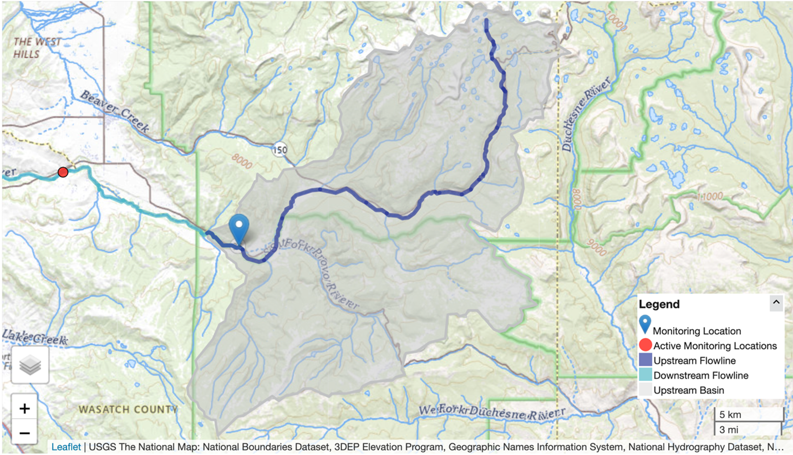

:::::::::::::::::::::::::::::::::::::: questions

- How should I prepare my run directory?
- What is the Data Preprocess tool?

::::::::::::::::::::::::::::::::::::::::::::::::

::::::::::::::::::::::::::::::::::::: objectives

- Identify the required data structure of a NextGen run in NGIAB
- Explain how the Data Preprocess tool interacts with NGIAB
- Prepare data for a NextGen run in NGIAB

::::::::::::::::::::::::::::::::::::::::::::::::

## Data Preprocess Tool

**The Data Preprocess tool streamlines data preparation for NextGen runs in NGIAB.** This tool provides a graphical user interface (GUI) and a command line interface (CLI) to prepare input data and execute model runs. A graphical user interface facilitates catchment and date range selection options via an interactive map, simplifying the subsetting of hydrofabrics, generation of forcings, and creation of default NextGen realizations. While this module reduces procedural complexity, it incorporates pre-defined assumptions that may limit user flexibility in specific applications [(Cunningham, 2025)](https://github.com/CIROH-UA/NGIAB_data_preprocess).

The Data Preprocess tool (like all of our software) is constantly being updated and refined. As of the time of writing (see last updated date above), there are two ways to run the tool. Instructions for installation, environment management, and the GUI/CLI are found on the [Data Preprocess GitHub page](https://github.com/CIROH-UA/NGIAB_data_preprocess).

The Data Preprocess tool (like all of our software) is constantly being updated and refined. As of the time of writing (see last updated date above), there are two ways to run the tool. Instructions for installation, environment management, and the GUI/CLI are found on the [Data Preprocess GitHub page](https://github.com/CIROH-UA/NGIAB_data_preprocess).

### CLI instructions


#### Example 1

This command allows you to run the Data Preprocess CLI tool without installing it. It produces forcings and a NextGen realization file for the catchments upstream of gage-10154200 for the time period 2017-09-01 to 2018-09-01. Forcing data is sourced from the zarr files in the [Analysis of Record for Calibration (AORC) dataset](https://registry.opendata.aws/noaa-nws-aorc/), which allows for a **faster processing time**.

Astral UV is required to run the Data Preprocess tool without installing it.

```bash
uvx --from ngiab_data_preprocess cli -i gage-10154200 -sfr --start 2017-09-01 --end 2018-09-01 --source aorc
```

`uvx --from ngiab_data_preprocess cli` indicates that the Data Preprocess tool will run without the user installing it.  The `-i` flag indicates the **I**D of the feature that is used to subset the hydrofabric. The `-sfr` flags indicate that the Data Preprocess tool will **s**ubset the hydrofabric to the desired catchments, produce **f**orcings over the desired area and time period, and produce a NextGen **r**ealization file. The `--start` and `--end` flags indicate the start and end dates of the desired time period. The `--source` flag determines where the Data Preprocess tool will pull forcing data from.

#### Example 2

This command produces forcings and a NextGen realization file for the catchments upstream of gage-10155000 for the time period 2022-08-13 to 2022-08-23 after installing the Data Preprocess tool. The forcing data source defaults to the NetCDF files in the [NWM 3.0 retrospective](https://aws.amazon.com/marketplace/pp/prodview-g6lcchc7brshw). Using this command requires you to have Astral UV (a package installer and environment manager) installed. Instructions for installing Astral UV are found in the [Astral UV documentation](https://docs.astral.sh/uv/#highlights).

To install the Data Preprocess tool, follow the latest instructions on the [Data Preprocess GitHub page](https://github.com/CIROH-UA/NGIAB_data_preprocess).

```bash
uv run cli -i gage-10155000 -sfr --start 2022-08-13 --end 2022-08-23
```

`uv run cli` indicates that the Data Preprocess CLI within your activated Astral UV environment will run.

#### Example 3

This command allows you to run the Data Preprocess CLI tool from a regular `pip install ngiab_data_preprocess`. **However, using Astral UV is highly recommended for its speed.** This command produces forcings for the catchments upstream of cat-7080 for the time period 2022-01-01 to 2022-02-28.

```bash
python -m ngiab_data_cli -i cat-7080 -f --start 2022-01-01 --end 2022-02-28
```

`python -m ngiab_data_cli` indicates that the Data Preprocess CLI tool will execute.

### GUI instructions

Either one of these commands will run the interactive GUI. The first command works without installing anything except UV. The second command requires the installation of the data preprocessor with UV.

```bash
uvx --from ngiab-data-preprocess map_app
```

```bash
uv run map_app
```

{alt='A screenshot of the USGS National Map centered on the Provo River network in Utah, showing streamflow and watershed data. A blue map marker identifies a Monitoring Location. A red dot marks an Active Monitoring Location farther downstream. The Upstream Basin is shaded in grey, while Upstream Flowlines and Downstream Flowlines are highlighted in dark and light blue, respectively. A scale bar in the bottom right shows distances of 5 kilometers and 3 miles. A map legend in the lower right corner explains the color codes for flowlines and monitoring locations.'}


{alt='A map view displaying the Provo River network and basin boundaries in the area around Woodland, UT. The map includes the stream network shown in blue, basin boundaries in orange shaded regions, the downstream-most basin in a pink shaded reagion, and black dots representing USGS gage locations.'}

## What models can I preprocess data for?

The Data Preprocessor tool supports a number of models that are integrated into NGIAB. These include:

- [Conceptual Functional Equivalent (CFE)](https://github.com/NOAA-OWP/cfe/tree/master) and [Noah-OWP-Modular (NOM)](https://github.com/NOAA-OWP/noah-owp-modular/tree/main) (default)
    - Developed by NOAA-OWP
- [Long Short-Term Memory (LSTM)](https://github.com/CIROH-UA/lstm/tree/ngiab)
    - Developed by NOAA-OWP, weights by Jonathan Frame (University of Alabama)
- [LSTM (Rust version)](https://github.com/CIROH-UA/rust-lstm)
    - Rust port of the original LSTM, developed by Josh Cunningham (University of Alabama)
- [Differentiable Hydrologiska Byråns Vattenbalansavdelning 2.0 (δHBV2.0) (Hourly version)](https://github.com/mhpi/dhbv2)
    - Developed by Wencong Yang et al. (Pennsylvania State University)
- [δHBV2.0 (Daily version)](https://github.com/mhpi/dhbv2)
    - Developed by Yalan Song et al. (Pennsylvania State University)
- [Structure for Unifying Multiple Modeling Alternatives (SUMMA)](https://github.com/CH-Earth/summa/tree/master)
    - Developed by Martyn Clark et al. (University of Calgary)
- [Snow17](https://github.com/NOAA-OWP/snow17)
    - National Oceanic and Atmospheric Administration, National Weather Service
- [Sacramento Soil Moisture Accounting Model](https://github.com/NOAA-OWP/sac-sma)
    - National Weather Service : State of California, Dept. of Water Resources


To preprocess data and configure a realization for a non-default model configuration, simply add a flag for that model at the end of the command.

```bash
uvx ngiab-prep -i gage-10154200 -sfr --start 2022-01-01 --end 2022-02-28 --lstm
#         you can replace --lstm with any other model, like --lstm_rust, --dhbv2, --dhbv2_daily, --summa
```

NGIAB will automatically detect which model you want to run by reading the realization.

## NextGen Run Directory Structure (`ngen-run/`)

Running NextGen requires building a standard run directory complete with only the necessary files. This is done automatically with the Data Preprocess tool. Below is an explanation of the standard run directory.

A NextGen run directory `ngen-run` contains the following subfolders:

- `config`:  model configuration files and hydrofabric configuration files. (required)
- `forcings`: catchment-level forcing timeseries files. Forcing files contain variables like wind speed, temperature, precipitation, and solar radiation. (required)
- `lakeout`: for t-route  (optional)
- `metadata` programmatically generated folder used within ngen. Do not edit this folder. (automatically generated)
- `outputs`: This is where ngen will place the output files. (required)
- `restart`: For restart files (optional)

```
ngen-run/
│
├── config/
│
├── forcings/
│
├── lakeout/
|
├── metadata/
│
├── outputs/
│
├── restart/
```

### Configuration directory `ngen-run/config/`
This folder contains the NextGen realization file, which serves as the primary model configuration for the ngen framework. This file specifies which models to run (such as NoahOWP/CFE, LSTM, etc), run parameters like date and time, and hydrofabric specifications (like location, gage, catchment).

Based on the models defined in the realization file, [BMI](https://bmi.csdms.io/en/stable/index.html) configuration files may be required. For those models that require per-catchment configuration files, a folder will hold these files for each model in `ngen-run/config/cat-config`. See the directory structure convention below.

```
ngen-run/
|
├── config/
|   │
|   ├── nextgen_09.gpkg
|   |
|   ├── realization.json
|   |
|   ├── ngen.yaml
|   |
|   ├── cat-config/
|   │   |
|   |   ├──PET/
|   │   |
|   |   ├──CFE/
|   │   |
|   |   ├──NOAH-OWP-M/
```

NextGen requires a single geopackage file. This file is the [hydrofabric (Johnson, 2022)](https://mikejohnson51.github.io/hyAggregate/) (spatial data). An example geopackage can be found on [Lynker Spatial's website](https://www.lynker-spatial.com/data?path=hydrofabric%2Fv2.2%2F) (note: creating an account is required to view Lynker Spatial data). Tools to subset a geopackage into a smaller domain can be found at [Lynker's hfsubset](https://github.com/LynkerIntel/hfsubset).

## Your Turn

Using the Data Preprocess tool, you should be able to create a run directory for your desired catchment that can be used with NGIAB. Try out both the GUI and the CLI, and experiment with different arguments and selection tools!

::::::::::::::::::::::::::::::::::::: keypoints

- `ngen-run/` is the standard NextGen run directory, containing the realization files that define models, parameters, and run settings; forcing data; outputs; as well as the spatial hydrofabric.
- The Data Preprocess tool simplifies preparing data for NextGen by offering a GUI and CLI for selecting catchments and date ranges, subsetting hydrofabric data, generating forcing files, and creating realization files.

::::::::::::::::::::::::::::::::::::::::::::::::

[r-markdown]: https://rmarkdown.rstudio.com/
