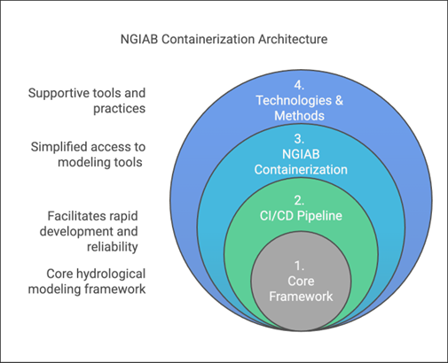
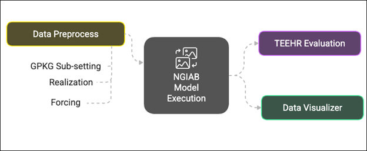

:::::::::::::::::::::::::::::::::::::: questions

- What is the NextGen Framework?
- What is NextGen in a Box (NGIAB)?
- What is containerization?
- Why should I use NGIAB?

::::::::::::::::::::::::::::::::::::::::::::::::

::::::::::::::::::::::::::::::::::::: objectives

- Identify key components of the NGIAB architecture
- Describe NGIAB's role in the NextGen Framework
- Determine use cases for NGIAB

::::::::::::::::::::::::::::::::::::::::::::::::

## Introduction to NextGen

The U.S. National Water Model (NWM) provides hydrologic predictions for over 2.7 million river reaches across the United States ([Cosgrove et al., 2024](https://doi.org/10.1111/1752-1688.13184)). **The Next Generation Water Resources Modeling Framework (NextGen) is an advancement of the NWM**, setting the stage for a more flexible modeling approach. NextGen promotes model interoperability and standardizes data workflows, allowing the integration of various hydrologic models tailored to specific regional processes, providing key flexibility needed for future success with continental-scale modeling. The NextGen framework continues to undergo testing, improvements, and updates through research efforts at the NOAA Cooperative Institute for Research to Operations in Hydrology (CIROH).

## What is NGIAB?

Managing NextGen's complex software ecosystem remains challenging. The NextGen framework’s implementation requires handling numerous software libraries and dependencies. To streamline this, we developed NextGen In A Box (NGIAB)—an open-source, containerized solution that encapsulates the NextGen framework and essential modeling components into a self-contained, reproducible application. By eliminating manual configuration burdens, NGIAB enables researchers to focus on scientific inquiry rather than software setup and maintenance. Beyond simplifying deployment of the NextGen Framework, NGIAB fosters collaboration among researchers, academic institutions, and government agencies by providing a scalable, community-driven modeling environment. **In essence, NGIAB provides a unified solution that powers NextGen models, including future versions of the NWM starting with version 4.**

::::::::::::::::::::::::::::::::::::: callout

### Terminology

- NextGen: overarching hydrologic modeling framework
- NGIAB: containerized distribution of NextGen
- `ngen`: model execution engine used within NextGen
- Community Hydrofabric: geospatial dataset containing catchments, flowpaths, nexus points, and watershed connectivity information
- NWM: operational implementation maintained by the National Weather Service

:::::::::::::::::::::::::::::::::::::::::::::

## Containerization

- Containerization addresses compatibility issues and hardware variation challenges by **encapsulating applications, their dependencies, and runtime environments into a single, portable unit**.
- Think of containerization like putting a model and all its tools into a sealed toolbox -- you can carry and run it anywhere, and everything needed is inside..
- This ensures consistent execution across diverse computing environments, regardless of differences in hardware or software configurations.
- NGIAB leverages Docker ([Boettiger, 2015](https://doi.org/10.1145/2723872.2723882)) and Singularity ([Hunt et al., 2005](https://www.researchgate.net/publication/236160050_An_Overview_of_the_Singularity_Project)) to streamline deployment.

## Architectural Components

NGIAB is designed as a multi-layered containerized tool that encapsulates the NextGen framework and many components relevant to the NWM within a reproducible environment.

{alt='A concentric circle diagram titled "NGIAB Containerization Architecture." It consists of four nested layers representing different components. At the center is "1. Core Framework" in gray, symbolizing the core hydrological modeling framework. Surrounding it is "2. CI/CD Pipeline" in green, representing tools that facilitate rapid development and reliability. The next layer is "3. NGIAB Containerization" in blue, indicating simplified access to modeling tools. The outermost layer is "4. Technologies & Methods" in dark blue, representing supportive tools and practices. Labels on the left of the diagram describe the increasing level of support from the core outward.'}

Figure 1 illustrates the layered architecture of NGIAB.

- **Layer 1:** At its core (Layer 1) lies a suite of integrated hydrological modeling components and hydrofabric (a geospatial dataset representing hydrologic features like rivers, basins, and connections), designed to work together within the NextGen framework. Hydrologic models in NGIAB are Basic Model Interface (BMI) compliant, meaning that they follow a standard structure and can be swapped in and out for one another.
- **Layer 2:** Layer 1 is wrapped by the Continuous Integration/Continuous Deployment (CI/CD) Pipeline layer (Layer 2). CI/CD are tools and practices that automate code testing and updates. NGIAB leverages GitHub Actions to ensure automated testing, integration, and deployment capabilities for reproducible workflows.
- **Layer 3:** The NGIAB Containerization layer (Layer 3) provides the containerized environment and essential configuration tools.
- **Layer 4:** The outermost layer (Layer 4), Technologies & Methods, provides broader infrastructure, best practices, and support for deployment across different computing environments (local, cloud, HPC), and facilitates community engagement and contribution.

The architecture emphasizes four key aspects:

- core hydrological modeling framework capabilities,
- simplified access to modeling tools,
- facilitation of rapid development and reliability,
- and integration of supportive tools and practices.

## Extensions of NGIAB

Several extensions of NGIAB are already integrated with supporting tools and datasets, including the [Community Hydrofabric](./community-hydrofabric.html), [Data Preprocessor](./data-preprocessor.html), [Tools for Exploratory Evaluation in Hydrologic Research (TEEHR)](./teehr.html), and [Data Visualizer](./visualization.html) (Figure 2).

{alt='A flowchart diagram showing the NGIAB model execution process. The central box labeled "NGIAB Model Execution" is connected to three components. To the left is a yellow-green box labeled "Data Preprocess" (Data Preprocessor), with three subcomponents listed: "GPKG Sub-setting," "Realization," and "Forcing." To the right, two boxes are connected to the center: a purple box labeled "TEEHR Evaluation" and a green box labeled "Data Visualizer." Dashed arrows indicate the flow of data between preprocessing, model execution, and evaluation/visualization.'} 

These components support a complete workflow from hydrofabric and forcing preparation through model execution, evaluation, calibration, and visualization.

## Example Applications

Steps common to all hydrologic modeling frameworks include data collection and preparation, framework setup and model execution, evaluation, results visualization, and calibration. Researchers can use NGIAB to execute model runs for their basins of interest. Figures 3 and 4 show examples of how NGIAB and its extensions have been used to simulate streamflow for five years in the Provo River basin.

{alt='A map view displaying the Provo River network and basin boundaries in the area around Woodland, UT. The map includes the stream network shown in blue, basin boundaries in orange shaded regions, the downstream-most basin in a pink shaded reagion, and black dots representing USGS gage locations.'}

![Figure 4: Map showing the geospatial visualization using the Data Visualizer for a selected outlet point as well as displaying a time series plot between observed (labeled “USGS”; blue line) and simulated (labeled “Ngen”; orange line) with the performance metrics (Kling-Gupta Efficiency (KGE), Nash-Sutcliffe Efficiency (NSE), and relative bias). These metrics assess how closely simulated results match observed data. The Visualizer can also show the performance of the NWM 3.0 compared to the observed time series.](fig/fig1-5.png){alt='A screenshot of the NextGen in a Box Visualizer web interface. The left panel contains a "Time Series Menu" where the user can select a Nexus ID, variable (e.g., flow), and TEEHR data source. A map in the center displays a stream reach with a highlighted section representing the drainage basin and a blue point, indicating the selected nexus location. Below the map, a time series plot compares USGS (blue line) and Ngen (orange line) streamflow data from 2017 to 2023. On the lower left, a table labeled "Teehr Metrics" presents performance metrics (e.g., Kling-Gupta Efficiency, Nash-Sutcliffe Efficiency, and Relative Bias) for the selected model versus reference data.'}

## Why should I use NGIAB?

NGIAB makes **community contribution** and **model integration** possible in research settings by simplifying setup and providing demos, allowing hydrologists and researchers to configure and modify localized water models. Built on open-source code and the `ngen`/BMI foundation, NGIAB allows integration of a hydrology process model into a larger hydrologic simulation framework, allowing a researcher to focus on their area of specific modeling expertise. Its lightweight container size also empowers hydrologists to execute large-scale runs efficiently and reduce computational bottlenecks. By strengthening collaboration across research teams, NGIAB will help drive the evolution of community-scale water modeling and accelerate the transition from academic innovation to real-world operational use.

## Your Turn

Here are some self-assessment questions for discussion or consideration:

- Do I understand how NGIAB fits into the NextGen Framework?
- What are the key design features and extensions of NGIAB?
- How can I use NGIAB to answer my research questions?
- How can I use NGIAB to contribute my expertise to the NextGen Framework?
- How do the Community Hydrofabric, Data Preprocessor, TEEHR, and Data Visualizer support the NGIAB workflow?

::::::::::::::::::::::::::::::::::::: keypoints

- The Next Generation Water Resources Modeling Framework (NextGen) advances the National Water Model with flexible, modular, and regionally adaptive hydrologic modeling at national scale.
- NextGen In A Box (NGIAB) packages the complex NextGen system into an open-source, containerized application for easier access and usability.
- NGIAB uses Docker and Singularity for portability across local machines, cloud platforms, and HPC systems.
- NGIAB's ecosystem includes the Community Hydrofabric, Data Preprocessor, TEEHR, Data Visualizer, and calibration tools that support end-to-end hydrologic modeling workflows.
- NGIAB fosters an open ecosystem where researchers, developers, and practitioners actively contribute new models, extensions, and workflows.

::::::::::::::::::::::::::::::::::::::::::::::::

[r-markdown]: https://rmarkdown.rstudio.com/
