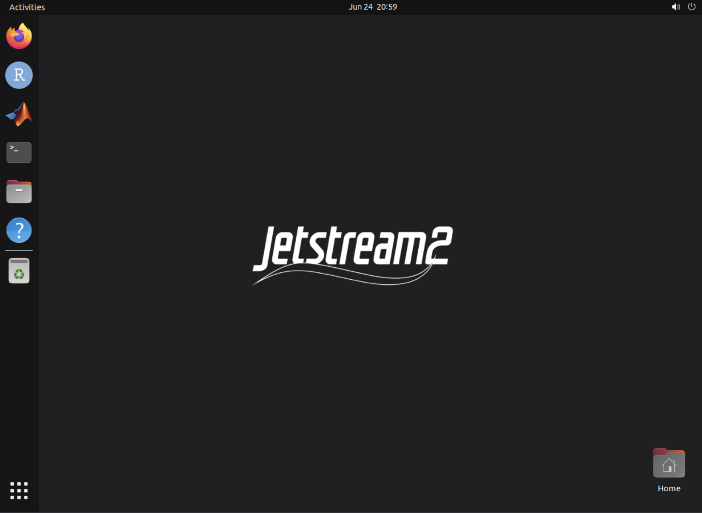

# Running NGIAB on Jetstream2

::::::::::::::::::::::::::::::::::::: callout

For the workshop, an instance may already be created for you. If so, skip ahead to [Connecting to your instance](#connecting-to-your-instance) and use the SSH credentials emailed to you. The steps below show how to create your own instance if you need to.

:::::::::::::::::::::::::::::::::::::::::::::

## Creating a Jetstream2 instance

1. Go to [https://jetstream2.exosphere.app/exosphere/](https://jetstream2.exosphere.app/exosphere/) and log in using your **NSF ACCESS** credentials.

2. Click **Create** → **Instance** and choose the **Ubuntu 24.04** image.

3. Choose an instance flavor based on your computational needs. For this workshop, **`m3.medium`** is a good general-purpose starting point.

4. In the instance configuration, set **"Enable web desktop?"** to **Yes**. This is what lets you open a web desktop in your browser later. It is required for the recommended workflow below.

5. Click **Create** and wait for the instance to finish building. When it is ready, you will be taken to the instance dashboard.

6. On the dashboard, find the **Credentials** section. Note the **public IP address** and the **passphrase**. You will use these to connect to the VM from your local machine.

## Connecting to your instance

You will connect to your instance in two stages:

1. Stage 1: **SSH Terminal.** This is what you use for everything in the [Running NextGen in a Box (NGIAB)](#running-nextgen-in-a-box-ngiab) section: running the ngiab data preprocess, the guide script, etc.
2. Stage 2: **Web Browser (as needed)** You only need this during the visualization step of the tasks, near the end. When you get there, use the **Jetstream Web Desktop** (recommended) or a VNC client.

Start with Step 1 now. Steps 2's two options are documented below so they're ready when you reach the visualization step. You don't need to set them up yet.

### Step 1: Open a terminal over SSH

To run the NGIAB commands, open a terminal on your own computer (Unix terminal or Windows command prompt / PowerShell) and connect to your instance:

```bash
ssh exouser@[ip.address]
```

Replace `[ip.address]` with the public IP address from your dashboard. When prompted, enter the **passphrase** shown in the Credentials section.

When logging in for the first time, you may be asked whether you'd like to trust the host. Type `yes` to continue. After verifying your credentials, you will be logged into your instance's terminal. You're now ready to start the [Running NextGen in a Box (NGIAB)](#running-nextgen-in-a-box-ngiab) section.

### Step 2: Viewing the visualizer in a browser

::::::::::::::::::::::::::::::::::::: callout

You only need this once you reach the **visualization step** in the tasks below (when the console prints a link like `http://127.0.0.1:8080/apps/ngiab`). Pick **one** of the two options below.

:::::::::::::::::::::::::::::::::::::::::::::

#### [Recommended] Jetstream Web Desktop

The Web Desktop gives you a full Linux desktop right in your web browser. This is the easiest way to view the NGIAB visualizer.

1. On your Jetstream2 instance dashboard, find the **Interactions** section and click **Web Desktop**.


2. A graphical desktop opens in a new browser tab.

   <!-- SCREENSHOT PLACEHOLDER: The Jetstream Web Desktop running in a browser tab, with a terminal and Firefox open. Save as fig/jetstream-web-desktop.png -->
   {alt='The Jetstream2 web desktop environment shown inside a browser tab.'}

3. Open **Firefox** inside the Web Desktop and go to the link printed by the console, for example:

   ```
   http://127.0.0.1:8080/apps/ngiab
   ```

#### Alternative: connecting with a VNC client

If you prefer a dedicated VNC client instead of the Web Desktop, you can connect over an SSH tunnel. This requires a VNC client installed on your computer. [RealVNC](https://www.realvnc.com/en/connect/download/viewer/) and [TigerVNC](https://tigervnc.org/) are common choices.

1. Open a **second** SSH session, separate from the one running your commands. This time with tunneling by adding the `-L` flag, which forwards the VNC port (`5906`) from the instance to your local machine:

   ```bash
   ssh -L 5906:localhost:5906 exouser@[ip.address]
   ```

   The `-L` flag is what makes the remote port reachable locally. Keep this terminal open for as long as you want the VNC connection to stay alive.

2. Open your VNC client (RealVNC or TigerVNC) and connect to:

   ```
   localhost:5906
   ```

   Enter the passphrase emailed to you / shown on the dashboard when prompted.

3. A remote desktop opens. Open the web browser inside it and enter the visualizer link printed by the console (e.g. `http://127.0.0.1:8080/apps/ngiab`).

::::::::::::::::::::::::::::::::::::: callout

You can also forward a plain web port (such as `80` or `8080`) instead of the VNC port to view the visualizer directly in your *local* browser, e.g. `ssh -L 8080:localhost:8080 exouser@[ip.address]`. If you see a message like "Could not request local forwarding", that port is already in use, pick a different one.

:::::::::::::::::::::::::::::::::::::::::::::

## Running NextGen in a Box (NGIAB)

Before starting this section, make sure you have `uv` installed, and make sure you have cloned the NGIAB-CloudInfra and DataStreamCLI repositories.

1. Verify you have Docker, and that it works as expected:
   ```bash
   docker run hello-world
   ```
   This should generate a message like this:
   ```
   Hello from Docker!
   This message shows that your installation appears to be working correctly.
   ```

2. Clone the NGIAB source code in your desired directory:
   ```bash
   cd /<path_to_directory>   # Optional: navigate to your desired directory
   git clone https://github.com/CIROH-UA/NGIAB-CloudInfra.git
   ```

3. Install `uv`:
   ```bash
   curl -LsSf https://astral.sh/uv/install.sh | sh
   ```

In this section, we will be running NOM+CFE+t-route for the area upstream of USGS gage 02342500 (Uchee Creek Near Fort Mitchell, Al.) over the time period 2020-01-01 to 2020-01-07.

### Data Preprocess

The NGIAB Data Preprocess has a built-in function to run NGIAB. This is convenient, but does not allow you to modify any of the preprocessed data files before the run starts.


```bash
uvx -p 3.10 --from ngiab-prep cli -i gage-02342500 -sfr --start 2020-01-01 --end 2020-01-07 --source aorc --run
```

{alt='Animated terminal recording of the data preprocessor running and automatically starting a NextGen simulation.'}

In this command, `uvx` allows for you to run the data preprocessor without installing it as a package. `-i gage-02342500` selects USGS gage 02342500 as the location to be modeled. `-s` subsets the NextGen hydrofabric geopackage, `-f` generates forcings, `-r` generates realization and BMI configuration files, `--start` and `--end` specify the start and end dates of the simulation, `--source` specifies the source of raw forcing data, and `--run` indicates that a Docker image containing NGIAB should be spun up after the data has been preprocessed, and a NextGen simulation should be automatically run with the data.

For more information on the data preprocessor and its functionalities, see the [documentation](https://github.com/CIROH-UA/NGIAB_data_preprocess).

### Data Preprocess + Guide Script

This method allows you to preprocess data and run NGIAB as separate steps. The guide script in the NGIAB-CloudInfra repository walks you through the NGIAB run and gives you the option to evaluate your results using TEEHR and visualize the results using the Tethys visualizer.

```bash
cd /path/to/NGIAB-CloudInfra
uvx --from ngiab-prep cli -i gage-02342500 -sfr --start 2020-01-01 --end 2020-01-07 --source aorc
chmod +x guide.sh
./guide.sh
```

{alt='Animated terminal recording of the guide script walking through a NextGen run.'}

When the guide script finishes the visualization step, view the results in the **Web Desktop** (recommended) by opening Firefox and going to the link printed by the console output (e.g. `http://127.0.0.1:8080/apps/ngiab`). If you are using a VNC client instead, first connect to `localhost:5906`, then open the link in the remote desktop's web browser.

{alt='Animated recording of the NGIAB Tethys visualizer displaying simulation results.'}


